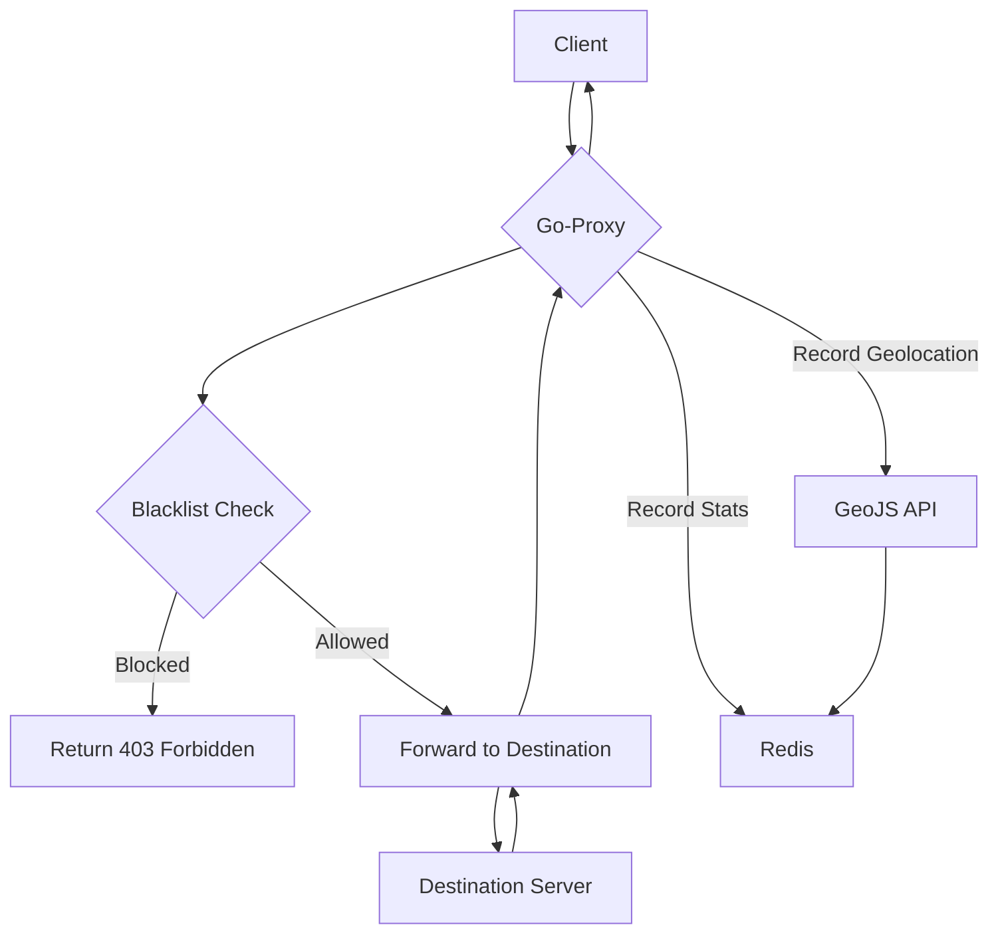
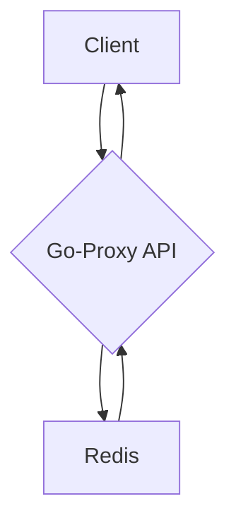

# Architecture

This document provides an overview of the Go-Proxy project's architecture, the technologies it uses, and the data flow.

## Technologies

*   **Go:** The core application is written in Go, a statically typed, compiled programming language designed at Google.
*   **Redis:** Redis is used for storing statistics and geolocation data.
*   **Docker:** Docker is used for containerization, making it easy to deploy and run the application in a consistent environment.
*   **GeoJS:** The GeoJS API is used for geolocating hosts.

## Architecture Overview

The Go-Proxy application is a monolithic application that is composed of several packages, each with a specific responsibility.

*   **`cmd/proxy`:** The main entry point of the application.
*   **`internal/proxy`:** The core proxying logic.
*   **`internal/api`:** The REST API for retrieving statistics and geolocation data.
*   **`internal/config`:** Configuration management.
*   **`internal/logger`:** Logging.
*   **`internal/storage`:** Redis storage.
*   **`internal/stats`:** Statistics collection.
*   **`internal/geo`:** Geolocation.

## Data Flow

### HTTP Request Flow

### Statistics API Flow

### Geolocation API Flow

